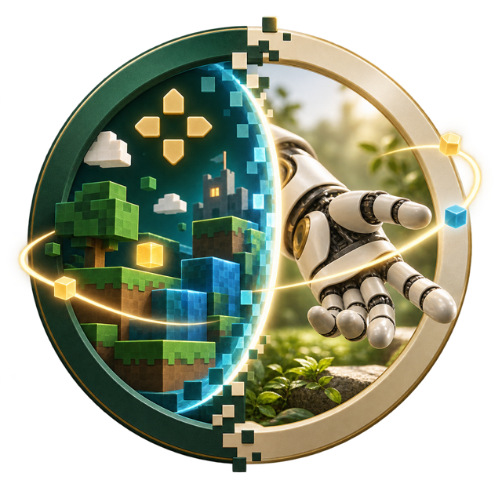
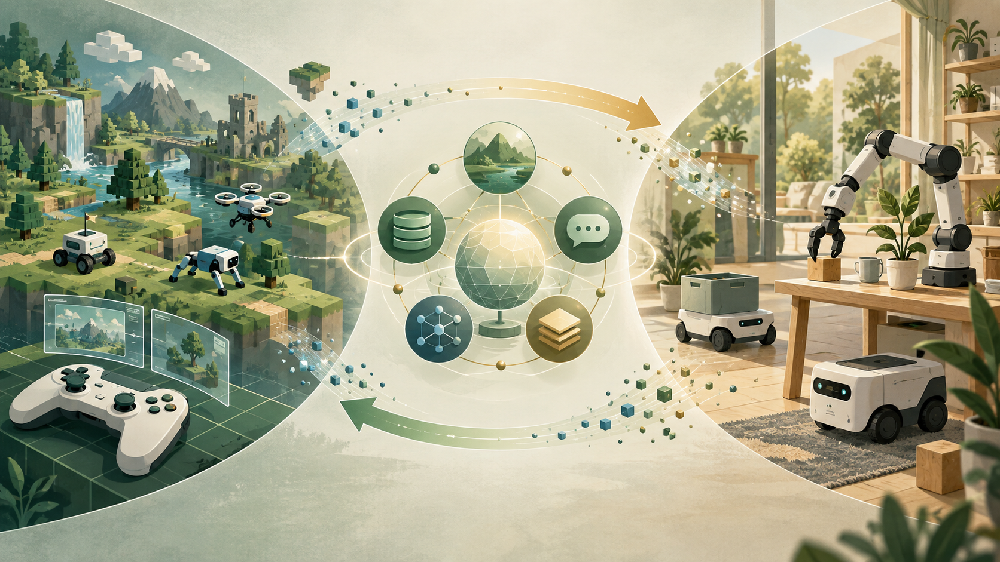

<div align="center">



# Awesome Game & Embodied Agents

[](https://awesome.re) [](https://lamda-nesy.github.io/Awesome-Game-Embodied-Agents/) [](https://lamda-nesy.github.io/Awesome-Game-Embodied-Agents/#all) [](https://lamda-nesy.github.io/Awesome-Game-Embodied-Agents/#papers) [](https://lamda-nesy.github.io/Awesome-Game-Embodied-Agents/#demos)
<br>
[](CONTRIBUTING.md) [](LICENSE) [](https://github.com/LAMDA-NeSy/Awesome-Game-Embodied-Agents)

[Game research](https://lamda-nesy.github.io/Awesome-Game-Embodied-Agents/#papers?domain=game) · [Embodied research](https://lamda-nesy.github.io/Awesome-Game-Embodied-Agents/#papers?domain=embodied) · [Projects](https://lamda-nesy.github.io/Awesome-Game-Embodied-Agents/#projects) · [Datasets](https://lamda-nesy.github.io/Awesome-Game-Embodied-Agents/#datasets) · [Benchmarks](https://lamda-nesy.github.io/Awesome-Game-Embodied-Agents/#benchmarks) · [Video demos](https://lamda-nesy.github.io/Awesome-Game-Embodied-Agents/#demos)

</div>

> A curated research map for agents that **perceive, reason, learn, and act**—from virtual game worlds to simulated and physical robots.

This repository connects game intelligence and embodied intelligence through papers, projects, datasets, benchmarks, and official demos. The full collection is designed for exploration on the [interactive website](https://lamda-nesy.github.io/Awesome-Game-Embodied-Agents/); this README is the short guide.

## Welcome

Researchers, engineers, students, and curious builders are all welcome. If the collection saves you time, please consider giving it a ⭐ and sharing it with your lab, reading group, class, or collaborators.

[](https://lamda-nesy.github.io/Awesome-Game-Embodied-Agents/) [](https://lamda-nesy.github.io/Awesome-Game-Embodied-Agents/#papers?domain=game) [](https://lamda-nesy.github.io/Awesome-Game-Embodied-Agents/#papers?domain=embodied) [](https://lamda-nesy.github.io/Awesome-Game-Embodied-Agents/#demos)

## Getting started

- **Understand:** begin with [surveys](https://lamda-nesy.github.io/Awesome-Game-Embodied-Agents/#papers?paperType=survey) and the collection’s topic filters.
- **Explore:** compare game control, world models, language–action systems, VLA policies, planning, and robot learning.
- **Build:** follow the linked [projects](https://lamda-nesy.github.io/Awesome-Game-Embodied-Agents/#projects), code, models, and datasets to the original sources.
- **Evaluate:** use [benchmarks](https://lamda-nesy.github.io/Awesome-Game-Embodied-Agents/#benchmarks) while keeping observation access, action spaces, and task definitions aligned.
- **Watch:** open the [video gallery](https://lamda-nesy.github.io/Awesome-Game-Embodied-Agents/#demos) for official gameplay, generated-world, simulation, and real-robot demos.

## Collection at a glance

| Research path | Curated resources |
| --- | ---: |
| Papers | **83** |
| Research articles | **6** |
| Open-source projects | **5** |
| Datasets | **4** |
| Benchmarks & environments | **8** |
| Video demos | **17** |

The snapshot contains **115 unique curated resources** and **8 candidates** awaiting review. Category counts overlap when one resource is both a paper and a dataset or benchmark.

## Our vision

<p align="center">
  <a href="docs/assets/future-vision.png"></a>
</p>

We want this collection to become a shared research map: traceable enough for careful comparison, approachable enough for newcomers, and open enough for the community to improve together.

## Selection criteria

| Track | Window | Standard |
| --- | --- | --- |
| Leading conferences & journals | 2021-09-14 – 2026-09-14 | Relevant publication with an official record |
| Important recent arXiv research | 2025-09-14 – 2026-09-14 | Clear influence or significance with supporting evidence |
| Tools & environments | Current research use | Official purpose, interfaces, and setup information |

Priority venues include NeurIPS, ICLR, ICML, CVPR, ICCV, ECCV, AAAI, IJCAI, CoRL, RSS, ICRA, IROS, Nature, Science, T-RO, IJRR, TPAMI, JMLR, and TMLR. Read the [full collection policy](docs/collection-policy.md) and [metadata notes](docs/metadata.md).

## 🤝 Contributing

Suggestions, corrections, new papers, working demos, and better summaries are welcome. Please read [CONTRIBUTING.md](CONTRIBUTING.md) or [open an issue](https://github.com/LAMDA-NeSy/Awesome-Game-Embodied-Agents/issues).

[](https://github.com/LAMDA-NeSy/Awesome-Game-Embodied-Agents/issues) [](CONTRIBUTING.md) [](https://lamda-nesy.github.io/Awesome-Game-Embodied-Agents/#updates)

## 📖 Citation

If this collection helps your work, cite the repository and the individual resources you use. A machine-readable [CITATION.cff](CITATION.cff) is included.

```bibtex
@misc{awesome-game-embodied-agents,
  title  = {Awesome Game & Embodied Agents},
  author = {Renmin Cheng and contributors},
  year   = {2026},
  url    = {https://github.com/LAMDA-NeSy/Awesome-Game-Embodied-Agents}
}
```

## 🙏 Acknowledgements

The game research starts from the supplied [Game Agent knowledge base](https://dy8q0bnq8y.feishu.cn/wiki/KAI9wbLEniLIIgkHAi6cU48bndd). Additional game and embodied resources come from official papers, project sites, and repositories. The organization and presentation are inspired by [Awesome Robot Use Agent](https://github.com/kairunwen/Awesome-Robot-Use-Agent#projects) by [Kairun Wen](https://github.com/kairunwen).

Original project code is released under the [MIT License](LICENSE). Papers, code, models, datasets, logos, and demos retain their respective rights.

<div align="center">

**If this research map is useful, a ⭐ helps more people find it.**

</div>
